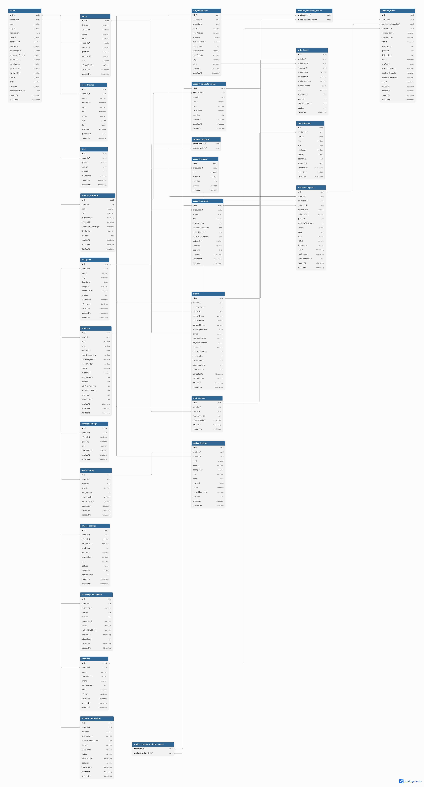

# InventoAI Backend

## Overview

InventoAI is a NestJS-based commerce platform for multi-store e-commerce operations, AI-powered storefront experiences, and intelligent business workflows. The backend powers store onboarding, catalog management, storefront browsing, customer chat, order processing, supplier purchasing, and AI-generated insights for store owners.

The system is designed around a multi-tenant store model, with each store owning its catalog, settings, products, FAQ, orders, conversations, and AI recommendations. It supports both owner/admin dashboard operations and public storefront APIs, while leveraging PostgreSQL, Redis, Gemini AI, and external services such as Cloudinary and Open-Meteo.

## Table of Contents

- [Features](#features)
- [Tech Stack](#tech-stack)
- [Architecture / ERD](#architecture--erd)
- [Flows Diagrams](#flows-diagrams)
- [Getting Started](#getting-started)
- [Environment Variables](#environment-variables)
- [Running the App](#running-the-app)
- [API Documentation](#api-documentation)
- [Project Structure](#project-structure)
- [How it Works](#how-it-works)

## Features

- **AI Site Builder** — questionnaire → AI-generated branding, theme, and storefront, hosted at `inventoai.com/SITENAME`
- **Smart Inventory** — sales/stock tracking feeding demand forecasts and restock triggers
- **Storefront API** — home, products, single product, cart, checkout, FAQ, with ranked, typo-tolerant search
- **Admin Dashboard API** — catalog, orders, suppliers, custom filters, statistics
- **Storefront Chatbot (multi-RAG)** — routes customer questions to product search, order status, or FAQ answers
- **Authentication** — email/password and Google Sign-In
- **Daily AI Advisor** — a scheduled brief combining calendar events, weather, sales trends, and restock triggers
- **Supplier Purchasing Flow** — AI-drafted purchase requests, reply ingestion via Gmail, and offer ranking

## Tech Stack

| Category | Choice |
| --- | --- |
| Framework | NestJS 11 |
| Language | TypeScript |
| Database | PostgreSQL + TypeORM |
| Cache / ephemeral state | Redis (ioredis) |
| Catalog search | Postgres full-text search + `pg_trgm` |
| Auth | Hand-rolled JWT guard (`@nestjs/jwt`), bcrypt |
| Mail | Nodemailer |
| Image storage | Cloudinary |
| Validation | class-validator + class-transformer |
| AI | Gemini |
| Testing | Jest (unit) + Supertest (e2e) |
| Local infra | Docker Compose (Postgres, Redis, Adminer) |

## Architecture / ERD

The project follows a modular NestJS architecture, with store-scoped feature modules for users, catalog, storefront, chatbot, orders, suppliers, FAQ, knowledge, advisor, and site builder.

### High-level architecture

- **API layer**: controllers and DTOs for storefront and dashboard endpoints
- **Service layer**: business logic for catalog, checkout, chatbot, AI advisor, supplier requests, and site generation
- **Persistence layer**: PostgreSQL with TypeORM entities and Redis for tokens, locks, and lightweight state
- **AI layer**: Gemini-powered generation, embeddings, retrieval, insights, and conversational tools
- **Infrastructure**: Docker Compose for local PostgreSQL/Redis/Adminer, Cloudinary for media upload, and SMTP for email delivery

### ERD



### Architectural principles

- Store-scoped authorization: all store-related queries are filtered by `storeId`
- AI features are isolated in dedicated modules: chatbot, knowledge, advisor, and site builder
- Orders and stock updates are transactional and guard against invalid inventory states
- Retrieval is hybrid: lexical + vector search with graceful degradation when vector support is unavailable

## Flows Diagrams

### 1) Site builder flow

1. A store owner answers a questionnaire about style, branding, and product positioning
2. The backend sends a structured prompt to Gemini
3. The AI generates brand identity, storefront content, and theme settings
4. The result is persisted against the store and exposed via the public storefront routes
5. The storefront is then served under the store slug, such as `inventoai.com/SITENAME`

```text
┌─────────────────────────┐
│  1. Brainstorm          │  POST /site-builder/brainstorm
│  (text + optional logo) │  → logo → Cloudinary
│                         │  → Gemini pre-fills questionnaire
└────────────┬────────────┘
             │ step = brainstormed
             ▼
┌─────────────────────────┐
│  2. Submit Answers      │  POST /site-builder/answers
│  (owner edits/confirms) │  → validated against question catalog
│                         │  → returns businessName + suggestedDomain
└────────────┬────────────┘
             │ step = answered
             ▼
┌─────────────────────────┐
│  3. Confirm Domain      │  POST /site-builder/domain
│  (owner picks slug)     │  → uniqueness + reserved-word check
│                         │  → Store row created (status = draft)
└────────────┬────────────┘
             │ step = domain_confirmed
             ▼
┌─────────────────────────┐
│  4. Generate Themes     │  POST /site-builder/themes
│  (AI proposes options)  │  → Gemini: description + 4 themes
│                         │  → validated against Theme contract
└────────────┬────────────┘
             │ step = themed
             ▼
┌─────────────────────────┐
│  5. Publish             │  POST /site-builder/publish
│  (owner picks a theme)  │  → selects theme
│                         │  → generates monogram logo if none uploaded
│                         │  → Store.status = live
└────────────┬────────────┘
             │ step = published
             ▼
┌────────────────────────┐
│  6. Store is live      │  GET /site/:slug   (public)
│                        │  → storefront renders from
│                        │    branding + theme data
└────────────────────────┘
```


### 2) Storefront chatbot flow

1. A customer sends a message to `/site/:slug/chat`
2. The backend resolves the correct store from the slug and optionally validates the user session
3. A request-scoped tool set is generated for the current store and user
4. Product search, FAQ lookup, and order-status tools are called as needed
5. The model replies using actual live data instead of freeform assumptions
6. The final outcome is computed from the tool results and returned to the user
7. Conversation history is stored in the chatbot module

This keeps the model grounded and reduces hallucination by tying the assistant to real services.

i. End-to-end request flow

```text
┌────────────────────────────┐
│  Shopper sends message     │  POST /site/:slug/chat
│  (signed in or anonymous)  │  { message, sessionId? }
└─────────────┬──────────────┘
              ▼
┌────────────────────────────┐
│  Guardrails (deterministic)│
│  1. resolve store          │──→ 404 if draft/unknown slug
│  2. resolve/create session │──→ 404 if foreign sessionId
│  3. rate limit (Redis)     │──→ 429 if exceeded
│  4. session message cap    │──→ friendly "start a new chat"
│  5. persist user message   │
└─────────────┬──────────────┘
              ▼
┌────────────────────────────┐
│   ChatAgentFactory         │  tool list built per request:
│   (tools scoped to         │  order tools included only if
│    storeId + userId)       │  a valid token is present
└─────────────┬──────────────┘
              ▼
      ┌──────────────────┐
      │   LangGraph      │   agent ⇄ tools loop
      │   (see below)    │   (max 4 iterations)
      └────────┬─────────┘
               ▼
┌────────────────────────────┐
│  finalize (deterministic)  │
│  - hydrate live rows       │  (price/stock never stale)
│  - compute resolution      │  answered / unanswered /
│                            │  off_topic / needs_login / error
└─────────────┬──────────────┘
              ▼
┌─────────────────────────────┐
│  ChatReplyDto returned      │
│  message + products[] +     │
│  order + faqs[] + resolution│
└─────────────────────────────┘
```

ii. The LangGraph agent loop (inside the box above)

```text
         ┌──────────────┐
 start ─▶│    agent     │◀────────────┐
         └──────┬───────┘             │
               │ tool_calls?          │
        ┌──────▼───────┐              │
        │    tools     │──────────────┘
        └──────┬───────┘
               │ no tool_calls
        ┌──────▼───────┐
        │   finalize   │─▶ end
        └──────────────┘

  tools available:
  search_products · get_product_details · check_availability
  search_faq · get_store_info
  list_my_orders · get_my_order   (signed-in sessions only)
```

iii. Hybrid retrieval (what search_products / search_faq call under the hood)

```text
                    query
                      │
           ┌──────────┴──────────┐
           ▼                     ▼
    Vector search           Lexical search
    (pgvector, cosine        (Postgres tsvector,
     similarity, all types)   products only)
           │                     │
           └──────────┬──────────┘
                      ▼
           Reciprocal Rank Fusion
              (rank-based, RRF_K=60)
                      ▼
              Fused hit list
        (pointers only: sourceType,
         sourceId, snippet, score)
                      ▼
        Hydrate from live service
        (storefront predicates re-applied —
         archived/draft rows drop out here)
                      ▼
                Tool result
```

### 3) AI advisor flow

1. The scheduler wakes up and collects store-specific signals
2. Sales, stock, weather, and calendar data are measured and normalized
3. The strongest insights are ranked and summarized
4. A lighter model rewrites the insights into natural-language recommendations
5. The final brief is stored per store and date, and owners can review or dismiss it

The advisor is intentionally resilient: failed collectors lose only their section, not the whole brief.

i. Signal pipeline (collectors → brief)

```text
┌──────────────────────────────────────────────────────────────────────┐
│           Collectors — run in parallel, Promise.allSettled           │
├────────────┬────────────┬────────────┬────────────┬──────────────────┤
│  Sales     │  Stock     │  Demand    │  Calendar  │   Weather        │
│  (orders)  │  (variants)│  gap       │  (Hijri +  │  (Open-Meteo,    │
│            │            │  (chatbot  │  fixed     │   optional —     │
│            │            │  unanswered│  dates)    │   needs lat/lng) │
│            │            │  themes)   │            │                  │
└─────┬──────┴─────┬──────┴─────┬──────┴─────┬──────┴────────┬─────────┘
      ▼            ▼            ▼            ▼               ▼
  stockout /     restock      demand_gap    seasonal_        weather
  trending /                                 event
  slow_mover
      │             │             │             │               │
      └─────────────┴──────┬──────┴─────────────┴───────────────┘
                           ▼
                    AdvisorSignal[]
          (every number lives here — pure arithmetic,
           a failed collector just loses its section)
                           ▼
                   rankInsights (pure)
        severity (critical→warning→info) → impact amount
              → kind order → dedupeKey (tiebreak)
                           ▼
              top MAX_INSIGHTS_PER_BRIEF (8)
                           ▼
                 AdvisorNarrator (Gemini)
         writes prose only — no numbers, no tools, no DB access
         (Gemini down → buildFallbackSentence template instead)
                           ▼
                 AdvisorBriefService
     writes AdvisorBrief + AdvisorInsight rows, one transaction
     (dedupeKey dismissed in last INSIGHT_SUPPRESSION_DAYS → dropped
      before it ever reaches the narrator)
                           ▼
            Dashboard reads it  /  mailed to the owner
```
ii. The scheduler (hourly cron, per live store)

```text
┌────────────────────────────┐
│  AdvisorScheduler          │  @Cron(EVERY_HOUR)
│  takes a Redis lock        │
└─────────────┬──────────────┘
              ▼
      for each LIVE store:
              ▼
   ┌────────────────────────┐
   │ isEnabled?             │──No──▶ skip
   └───────────┬────────────┘
               │ Yes
               ▼
   ┌────────────────────────┐
   │ local time == sendHour?│──No──▶ skip
   └───────────┬────────────┘
               │ Yes
               ▼
   ┌────────────────────────┐
   │ today's brief already  │──Yes──▶ skip
   │ exists? (unique index) │
   └───────────┬────────────┘
               │ No
               ▼
      run the pipeline above
      (generate + write brief)
               ▼
   ┌───────────────────────┐
   │ emailEnabled?         │──No──▶ done
   └───────────┬───────────┘
               │ Yes
               ▼
     mail owner AFTER commit
   (mail failure never loses the brief)
```


### 4) Purchase request flow

1. The system identifies products requiring restock or pricing action
2. A purchase request is drafted for the relevant suppliers
3. Supplier offers are generated, normalized, and ranked by cost and speed
4. The owner sends the request using email or mailbox integration
5. Replies are ingested, extracted, and compared to select the best offer
6. The final recommendation is surfaced to the owner for confirmation

This keeps purchasing decisions tied to measurable data and comparison logic, rather than only freeform model output.

i. End-to-end flow ("Low Stock" → "Deal Closed")

```text
┌────────────────────────────────┐
│  1. Create request             │  POST /purchase-requests
│  (from a restock insight, or   │  { variantId, quantity, supplierIds[] }
│   picked manually)             │  → AI drafts subject + body (Gemini)
│                                │  → status = draft, nothing sent yet
└─────────────┬──────────────────┘
              ▼
┌────────────────────────────────┐
│  2. Owner reviews & sends      │  POST /purchase-requests/:id/send
│  (can edit subject/body,       │  → one SupplierOffer per recipient,
│   quantity, recipients first)  │    status = awaiting
│                                │  → request status = sent
└─────────────┬──────────────────┘
              ▼
┌────────────────────────────────┐
│  3. Supplier replies           │  paste (phase 1, always available)
│                                │  or auto-synced from the owner's
│                                │  Gmail (phase 2, see below)
│                                │  → AI extracts price/qty/delivery
│                                │  → offer status = received
│                                │  → request status = replied
└─────────────┬──────────────────┘
              ▼
┌────────────────────────────────┐
│  4. Offers ranked              │  GET /purchase-requests/:id
│  (rankOffers, pure function)   │  on-time before late → total ASC
│                                │  → deliveryDays ASC → createdAt ASC
│                                │  flags: isRecommended / isCheapest /
│                                │  isFastest / isLate
└─────────────┬──────────────────┘
              ▼
┌────────────────────────────┐
│  5. Owner confirms one     │  POST …/offers/:offerId/confirm
│                            │  → winner: won · rest: declined
│                            │  → confirmation + decline emails sent
│                            │    (after commit, allSettled)
│                            │  → request status = confirmed (terminal)
└────────────────────────────┘
```

## Getting Started

### Prerequisites

- Node.js 20+
- npm / yarn / pnpm
- Docker + Docker Compose
- PostgreSQL 15 (via Docker Compose)
- Redis (via Docker Compose)

### Installation

```bash
# Clone the repo
git clone [REPO_URL]
cd [REPO_DIRECTORY]

# Install dependencies
npm install

# Copy the example env file and fill in your own values
cp .env.example .env

# Start local infra (Postgres, Redis, Adminer)
docker compose up -d

# Run the app in dev mode
npm run start:dev
```

## Environment Variables

The application validates all required environment variables at startup using the schema in `src/config/env.validation.ts`. Missing or mistyped values will prevent the server from booting.

### Core app

| Variable | Description | Example |
| --- | --- | --- |
| `NODE_ENV` | Runtime environment | `development` |
| `PORT` | Server port | `3000` |
| `DATABASE_HOST` | PostgreSQL host | `localhost` |
| `DATABASE_PORT` | PostgreSQL port | `5432` |
| `DATABASE_USER` | Database username | `postgres` |
| `DATABASE_PASSWORD` | Database password | `postgres` |
| `DATABASE_NAME` | Database name | `inventoai` |
| `REDIS_HOST` | Redis host | `localhost` |
| `REDIS_PORT` | Redis port | `6379` |
| `CORS_ORIGINS` | Allowed frontend origins | `http://localhost:4200` |
| `SITE_BASE_URL` | Frontend base URL | `http://localhost:4200` |

### Auth and security

| Variable | Description | Example |
| --- | --- | --- |
| `JWT_ACCESS_SECRET` | Access token secret | `your_secret` |
| `JWT_REFRESH_SECRET` | Refresh token secret | `your_secret` |
| `JWT_ACCESS_EXPIRES_IN` | Access token lifetime | `15m` |
| `JWT_REFRESH_EXPIRES_IN` | Refresh token lifetime | `7d` |
| `OTP_EXPIRES_IN_SECONDS` | OTP lifetime | `300` |
| `OTP_RESEND_COOLDOWN_SECONDS` | Resend cooldown | `60` |
| `GOOGLE_CLIENT_ID` | Google Sign-In client ID | `...apps.googleusercontent.com` |
| `GOOGLE_CLIENT_SECRET` | Gmail owner-mailbox OAuth secret | `...` |
| `GOOGLE_MAILBOX_REDIRECT_URI` | Gmail consent callback | `http://localhost:4200/dashboard/mailbox/callback` |
| `MAILBOX_TOKEN_ENCRYPTION_KEY` | AES key for stored mailbox refresh tokens | `openssl rand -hex 32` |

### Mail and media

| Variable | Description | Example |
| --- | --- | --- |
| `MAIL_HOST` | SMTP host | `smtp.gmail.com` |
| `MAIL_PORT` | SMTP port | `587` |
| `MAIL_USER` | SMTP username | `noreply@example.com` |
| `MAIL_PASSWORD` | SMTP password | `app_password` |
| `MAIL_FROM` | Sender email | `noreply@inventoai.com` |
| `PLATFORM_LOGO_URL` | Public logo URL used in emails | `https://.../logo.png` |
| `CLOUDINARY_CLOUD_NAME` | Cloudinary cloud name | `demo` |
| `CLOUDINARY_API_KEY` | Cloudinary API key | `...` |
| `CLOUDINARY_API_SECRET` | Cloudinary API secret | `...` |
| `CLOUDINARY_FOLDER` | Default upload folder | `inventoai` |

### AI and app integrations

| Variable | Description | Example |
| --- | --- | --- |
| `GEMINI_API_KEY` | Gemini API key | `...` |
| `GEMINI_MODEL` | Primary generation model | `gemini-3.7-flash` |
| `GEMINI_EMBEDDING_MODEL` | Embedding model | `gemini-embedding-001` |
| `EMBEDDING_DIMENSIONS` | Vector dimensions | `768` |
| `CHATBOT_MODEL` | Chatbot inference model | `gemini-3.1-flash-lite` |
| `CHATBOT_MAX_MESSAGES_PER_SESSION` | Chat context limit | `40` |
| `CHATBOT_RATE_LIMIT_PER_MINUTE` | Per-minute rate limit | `10` |
| `CHATBOT_HISTORY_TURNS` | Conversation history turns | `8` |
| `ADVISOR_WEATHER_BASE_URL` | Open-Meteo endpoint | `https://api.open-meteo.com/v1` |
| `ADVISOR_DEFAULT_TIMEZONE` | Fallback timezone | `Africa/Cairo` |
| `ADVISOR_MODEL` | Advisor prose model | `gemini-3.1-flash-lite` |
| `GOOGLE_GMAIL_API_BASE_URL` | Gmail base API URL | `https://gmail.googleapis.com/gmail/v1` |

## Running the App

```bash
# development
npm run start:dev

# production build
npm run build
npm run start:prod

# lint / format
npm run lint
npm run format

# tests
npm test
npm run test:e2e
```

### Local infrastructure

```bash
# start PostgreSQL + Redis + Adminer
docker compose up -d

# run the seed script for development data
npm run seed -- --force
```

The seed script wipes the database and recreates a known set of stores, accounts, products, FAQ entries, chats, and orders for local development. It refuses to run outside `NODE_ENV=development`.

## API Documentation

Full interactive API reference (Apidog):

🔗 **https://invento-ai.apidog.io/**

🔑 Password: `Invento@2026`

Below is a quick index of every endpoint. See the full docs above for request/response schemas, examples, and error codes.

### Auth & Account
| Endpoint | Description |
|---|---|
| `POST /users/register/owner` | Register a new store owner (platform) account |
| `POST /users/register` | Register a new customer account for a store |
| `POST /users/login/owner` | Log in as a store owner |
| `POST /users/login` | Log in as a customer |
| `POST /users/google` | Google Sign-In for a customer of a store |
| `POST /users/google/owner` | Google Sign-In for a store owner |
| `POST /users/verify-email/owner` | Verify an owner's email with an OTP |
| `POST /users/verify-email` | Verify a customer's email with an OTP |
| `POST /users/resend-verification/owner` | Resend the owner's verification code |
| `POST /users/resend-verification` | Resend a customer's verification code |
| `PATCH /users/change-password` | Change the current user's password |
| `POST /users/refresh-token` | Exchange a refresh token for a new access/refresh pair |
| `POST /users/forgot-password/owner` | Start the owner password-reset flow |
| `POST /users/forgot-password` | Start a customer's password-reset flow |
| `POST /users/reset-password/owner` | Reset the owner's password with an OTP |
| `POST /users/reset-password` | Reset a customer's password with an OTP |

### Site Builder
| Endpoint | Description |
|---|---|
| `GET /site-builder/questions` | Get the AI onboarding questionnaire |
| `POST /site-builder/brainstorm` | Pre-fill questionnaire answers from free text + logo |
| `POST /site-builder/answers` | Submit questionnaire answers |
| `POST /site-builder/domain` | Confirm the store's business name and domain slug |
| `POST /site-builder/themes` | Generate AI theme options for the store |
| `GET /site-builder/themes` | Get the store's generated theme options |
| `POST /site-builder/publish` | Publish the store with a chosen theme |

### Store Settings
| Endpoint | Description |
|---|---|
| `PATCH /stores/me/hero` | Update the store's landing page hero section |

### Catalog / Categories
| Endpoint | Description |
|---|---|
| `POST /categories` | Add a category |
| `GET /categories` | List categories (paginated, filterable) |
| `PATCH /categories/reorder` | Reorder categories |
| `GET /categories/{id}` | Get a category by id |
| `PATCH /categories/{id}` | Update a category |
| `DELETE /categories/{id}` | Delete a category |
| `PUT /categories/{id}/image` | Upload/replace a category image |
| `DELETE /categories/{id}/image` | Delete a category image |

### Catalog / Product Attributes
| Endpoint | Description |
|---|---|
| `GET /product-attributes` | List product attributes and their values |
| `POST /product-attributes` | Create a product attribute |
| `PATCH /product-attributes/reorder` | Reorder attributes |
| `GET /product-attributes/{id}` | Get an attribute by id |
| `PATCH /product-attributes/{id}` | Update an attribute |
| `DELETE /product-attributes/{id}` | Delete an attribute |
| `POST /product-attributes/{id}/values` | Add a value to an attribute |
| `PATCH /product-attributes/{id}/values/reorder` | Reorder an attribute's values |
| `PATCH /product-attributes/{id}/values/{valueId}` | Update an attribute value |
| `DELETE /product-attributes/{id}/values/{valueId}` | Delete an attribute value |

### Catalog / AI Setup
| Endpoint | Description |
|---|---|
| `POST /catalog/generate` | AI-generate a proposed catalog (categories/attributes) from the questionnaire |
| `POST /catalog/apply` | Write a (possibly edited) AI-generated catalog proposal |

### Catalog / Products
| Endpoint | Description |
|---|---|
| `POST /products` | Create a product with its variants |
| `GET /products` | List products (dashboard, paginated/filterable) |
| `PATCH /products/reorder` | Reorder products |
| `GET /products/{id}` | Get a product by id (dashboard view) |
| `PATCH /products/{id}` | Update a product's core fields |
| `DELETE /products/{id}` | Soft-delete a product |

### Catalog / Variants
| Endpoint | Description |
|---|---|
| `POST /products/{id}/variants/generate` | Bulk-generate variants from attribute axes (matrix builder) |
| `POST /products/{id}/variants` | Add a single variant |
| `PATCH /products/{id}/variants/{variantId}` | Update a variant |
| `DELETE /products/{id}/variants/{variantId}` | Delete a variant |

### Catalog / Product Images
| Endpoint | Description |
|---|---|
| `POST /products/{id}/images` | Upload product images |
| `PATCH /products/{id}/images/reorder` | Reorder product images |
| `PATCH /products/{id}/images/{imageId}` | Update an image's alt text |
| `DELETE /products/{id}/images/{imageId}` | Delete a product image |

### FAQ
| Endpoint | Description |
|---|---|
| `POST /faqs` | Add an FAQ entry |
| `GET /faqs` | List all FAQ entries (dashboard) |
| `PATCH /faqs/reorder` | Reorder FAQ entries |
| `GET /faqs/{id}` | Get an FAQ entry by id |
| `PATCH /faqs/{id}` | Update an FAQ entry |
| `DELETE /faqs/{id}` | Delete an FAQ entry |

### Orders
| Endpoint | Description |
|---|---|
| `GET /orders` | List orders (owner order desk) |
| `GET /orders/{id}` | Get one order with its lines |
| `PATCH /orders/{id}/status` | Advance or cancel an order's fulfilment status |
| `PATCH /orders/{id}/note` | Update the owner's private note on an order |

### Storefront / Site
| Endpoint | Description |
|---|---|
| `GET /site/{slug}` | Get a published store's public profile |
| `GET /site/{slug}/categories` | Get a store's published categories |
| `GET /site/{slug}/faqs` | Get a store's published FAQ |

### Storefront / Catalog
| Endpoint | Description |
|---|---|
| `GET /site/{slug}/products` | Search/filter a store's live products |
| `GET /site/{slug}/products/suggest` | Search-box autocomplete suggestions |
| `GET /site/{slug}/products/{productSlug}` | Get a storefront product detail page |
| `GET /site/{slug}/filters` | Get sidebar filter facets with live counts |

### Storefront / Orders
| Endpoint | Description |
|---|---|
| `POST /site/{slug}/orders` | Place an order (checkout) |
| `GET /site/{slug}/orders/me` | Get the current customer's order history |
| `GET /site/{slug}/orders/me/{orderNumber}` | Get one of the current customer's orders |
| `POST /site/{slug}/orders/me/{orderNumber}/cancel` | Cancel a pending order (customer) |

### Storefront / Chat
| Endpoint | Description |
|---|---|
| `GET /site/{slug}/chat/settings` | Get the public chat widget settings |
| `POST /site/{slug}/chat` | Send a message to the storefront chatbot |
| `GET /site/{slug}/chat/{sessionId}` | Get a chat conversation transcript (shopper view) |

### Chatbot / Knowledge Base
| Endpoint | Description |
|---|---|
| `GET /knowledge/status` | Get chatbot knowledge base indexing status |
| `POST /knowledge/reindex` | Rebuild the chatbot knowledge base |

### Chatbot / Insights
| Endpoint | Description |
|---|---|
| `GET /chat/sessions` | List chatbot conversation transcripts |
| `GET /chat/sessions/{id}` | Get one chatbot transcript in full |
| `GET /chat/unanswered` | Get grouped themes of unanswered shopper questions |
| `PATCH /chat/unanswered/{messageId}/review` | Mark an unanswered theme as reviewed |
| `GET /chat/stats` | Get chatbot usage stats for a window |
| `GET /chat/settings` | Get chatbot settings (greeting, tone, etc.) |
| `PATCH /chat/settings` | Update chatbot settings |

### Advisor
| Endpoint | Description |
|---|---|
| `GET /advisor/brief` | Get today's Daily AI Advisor brief |
| `GET /advisor/briefs` | List past briefs |
| `GET /advisor/briefs/{id}` | Get one brief with its insights |
| `POST /advisor/generate` | Generate a new brief on demand |
| `PATCH /advisor/insights/{id}` | Mark a brief insight as acted on or dismissed |
| `GET /advisor/settings` | Get advisor settings (schedule, location, lead time) |
| `PATCH /advisor/settings` | Update advisor settings |

### Suppliers
| Endpoint | Description |
|---|---|
| `POST /suppliers` | Add a supplier |
| `GET /suppliers` | List suppliers |
| `GET /suppliers/{id}` | Get a supplier by id |
| `PATCH /suppliers/{id}` | Update a supplier |
| `DELETE /suppliers/{id}` | Soft-delete a supplier |

### Purchase Requests
| Endpoint | Description |
|---|---|
| `POST /purchase-requests` | Create a draft purchase request (AI-drafted email) |
| `GET /purchase-requests` | List purchase requests |
| `GET /purchase-requests/{id}` | Get a purchase request with its ranked offers |
| `PATCH /purchase-requests/{id}` | Edit a draft purchase request |
| `POST /purchase-requests/{id}/send` | Email the purchase request to its suppliers |
| `POST /purchase-requests/{id}/cancel` | Cancel a purchase request |
| `POST /purchase-requests/{id}/offers/{offerId}/reply` | Paste in a supplier's reply for AI extraction |
| `PATCH /purchase-requests/{id}/offers/{offerId}` | Manually correct an offer's price/quantity/delivery |
| `POST /purchase-requests/{id}/offers/{offerId}/confirm` | Confirm the winning offer and close the deal |


## Project Structure

```text
.
├─ src/
│  ├─ advisor/                 # Daily AI Advisor logic, collectors, scheduler, prompts
│  ├─ ai/                      # AI abstraction layer and Gemini service
│  ├─ auth/                    # JWT, Google token verification, auth guards
│  ├─ catalog/                 # Products, categories, attributes, variants, search
│  ├─ chatbot/                 # Storefront assistant, tools, messages, sessions
│  ├─ common/                  # Shared DTOs, validators, decorators, helpers
│  ├─ config/                  # Environment validation and config setup
│  ├─ database/                # DB config and TypeORM setup
│  ├─ faq/                     # FAQ entities and APIs
│  ├─ knowledge/               # RAG indexing, embeddings and hybrid retrieval
│  ├─ mail/                    # Mail service and OTP templates
│  ├─ orders/                  # Checkout, order lifecycle, analytics
│  ├─ redis/                   # Redis wrapper and cache logic
│  ├─ site-builder/            # AI site builder, themes, and storefront setup
│  ├─ storage/                 # Cloudinary media processing
│  ├─ suppliers/               # Purchase requests, offers, mailbox integration
│  ├─ users/                   # Auth flow, users, OTP, Google Sign-In
│  ├─ app.module.ts
│  ├─ app.controller.ts
│  ├─ app.service.ts
│  ├─ main.ts
│  └─ ...
├─ context/                    # Project docs and feature specs
├─ docs/                       # Documentation assets and diagrams
├─ scripts/                    # DB seeding and utility scripts
├─ test/                       # e2e test setup
├─ .env.example
├─ docker-compose.yml
├─ package.json
├─ tsconfig.json
├─ nest-cli.json
├─ README.md
├─ SETUP.md
├─ TODO.md
└─ ...
```

